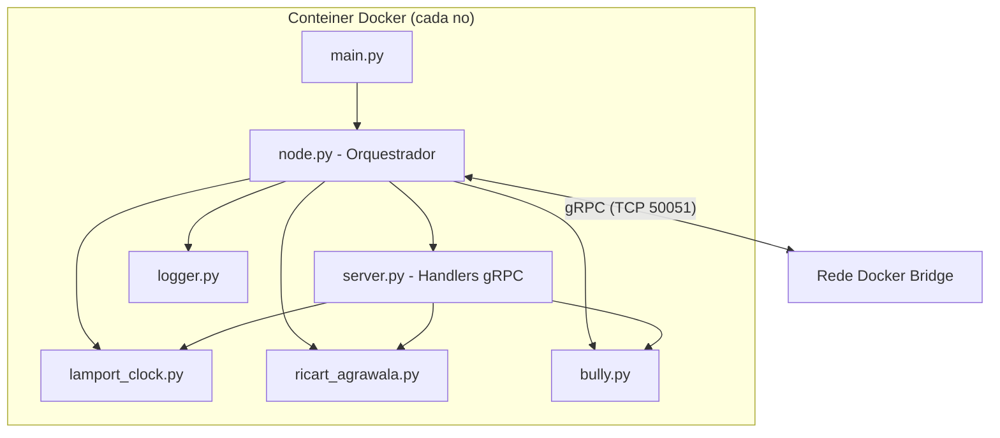
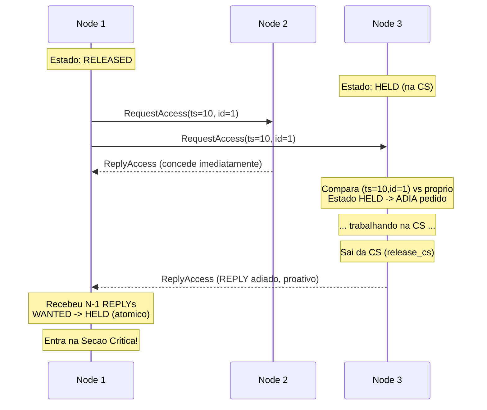
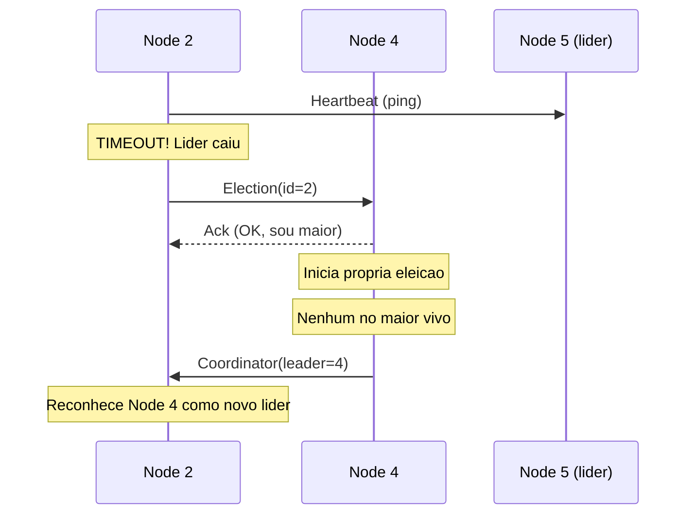

# Relatório Técnico — Trabalho 2 MC714

---

## 1. Descrição do Problema e Solução Escolhida

O objetivo deste trabalho é implementar um sistema distribuído que demonstre, de forma integrada, três conceitos fundamentais da disciplina:

1. **Relógio Lógico de Lamport** — ordenação causal de eventos.
2. **Exclusão Mútua Distribuída** — garantir que apenas um processo acesse um recurso compartilhado por vez.
3. **Eleição de Líder** — tolerância a falhas com detecção e recuperação automática de liderança.

### Por que esses três juntos?

A escolha foi deliberada para que os algoritmos se **integrem organicamente** em vez de funcionarem como demos isoladas:

- O **Relógio de Lamport** está embutido em *todas* as mensagens trocadas entre os nós (campo `lamport_ts` em todo RPC). Isso garante que o relógio evolui a cada interação, evidenciando causalidade.
- O **Ricart-Agrawala** usa exatamente o par `(lamport_ts, node_id)` como critério de ordenação total para decidir prioridade entre pedidos concorrentes à Seção Crítica. O Lamport é a "cola" que torna a exclusão mútua distribuída possível.
- O **Bully** roda em paralelo, detectando falhas do líder via heartbeat e garantindo que o sistema se recupera automaticamente quando um nó cai.

---

## 2. Arquitetura e Decisões de Implementação

### Stack tecnológica

| Componente | Escolha | Justificativa |
|------------|---------|---------------|
| Linguagem | Python 3.11 | Máxima legibilidade dos algoritmos; threading nativo |
| Comunicação | gRPC + Protocol Buffers | Comunicação real via TCP; contrato tipado; sem simulação por arquivos |
| Ambiente | Docker Compose (5 contêineres) | Cada nó é um processo isolado com rede própria |
| Concorrência | `threading.Lock` | Protege estado compartilhado contra race conditions do ThreadPool do gRPC |

### Decisão-chave: RPCs separadas para REQUEST e REPLY

O gRPC usa um ThreadPool fixo para processar RPCs. Se o handler de `RequestAccess` bloqueasse esperando a Seção Crítica liberar, esgotaríamos o pool e causaríamos deadlock.

**Solução:** Separamos `RequestAccess` (receber pedido) e `ReplyAccess` (conceder permissão) como duas RPCs distintas. O handler de `RequestAccess` **nunca bloqueia**: registra o pedido na fila de adiados e retorna `Ack` imediatamente. Quando o detentor da CS a libera, ele **proativamente** envia `ReplyAccess` aos nós adiados via threads separadas.

### Thread-safety

O servidor gRPC injeta múltiplas threads simultaneamente. Todos os módulos protegem seu estado:

- `LamportClock`: `threading.Lock` em `tick()` e `update()`; log emitido fora do lock para não segurar o lock durante I/O.
- `RicartAgrawala`: um único lock cobre `state`, `request_ts`, `_pending_replies` e `_deferred`.
- `BullyElection`: lock protege `leader_id` e `election_in_progress`.

A transição `WANTED → HELD` é feita **atomicamente** dentro de `on_reply()`, eliminando qualquer janela de race condition entre receber o último REPLY e marcar o estado como HELD.

### Diagrama de componentes



---

## 3. Sistema de Comunicação

### Contrato gRPC (`proto/node.proto`)

O serviço `NodeService` expõe 5 RPCs unárias (fire-and-forget):

| RPC | Algoritmo | Descrição |
|-----|-----------|-----------|
| `RequestAccess` | Ricart-Agrawala | REQUEST: pedir permissão para CS |
| `ReplyAccess` | Ricart-Agrawala | REPLY: conceder permissão (imediato ou diferido) |
| `Election` | Bully | Enviar ELECTION a nós de ID maior |
| `Coordinator` | Bully | Anunciar novo líder |
| `Heartbeat` | Detecção de falhas | Ping/Pong para verificar vivacidade do líder |

**Princípio fundamental:** *todas* as mensagens carregam `lamport_ts`, garantindo que o relógio evolui em cada troca de mensagem.

### Diagrama de sequência: Ricart-Agrawala com adiamento



### Diagrama de sequência: Eleição Bully (falha do líder)



---

## 4. Ambiente de Execução

### Infraestrutura Docker Compose

```yaml
# 5 serviços idênticos (mesmo Dockerfile), diferenciados por NODE_ID
services:
  node1..node5:
    build: .
    environment:
      - NODE_ID=N
      - PEERS=node1:50051,node2:50051,...,node5:50051
      - CS_INTERVAL=5
    networks: [cluster]

networks:
  cluster:
    driver: bridge
```

- **Rede bridge isolada**: os nós se comunicam por hostname (`node1`, `node2`, etc.) na porta 50051.
- **Resiliência de inicialização**: cada nó executa `wait_for_peers()` com retry + backoff exponencial antes de iniciar a eleição. Isso garante que o sistema não quebra se um contêiner subir milissegundos antes dos demais.
- **Demonstração de falha**: `docker stop nodeX` simula a queda de um nó, acionando o fluxo de reeleição.

### Dockerfile

- Base: `python:3.11-slim`
- Stubs gRPC são gerados **dentro** do contêiner (`grpc_tools.protoc`), garantindo consistência de versões.
- `PYTHONUNBUFFERED=1` garante que os logs aparecem imediatamente no terminal.

---

## 5. Testes Realizados e Resultados

### Teste 1: Eleição inicial

Ao subir o cluster, o algoritmo Bully converge para o Node 5 (maior ID) como líder:

```
👑 [BULLY]   Node 5 | Nenhum no maior respondeu. SOU O NOVO LIDER! Anunciando COORDINATOR a [1, 2, 3, 4]
👑 [BULLY]   Node 1 | Reconhece Node 5 como o novo LIDER.
👑 [BULLY]   Node 2 | Reconhece Node 5 como o novo LIDER.
👑 [BULLY]   Node 3 | Reconhece Node 5 como o novo LIDER.
👑 [BULLY]   Node 4 | Reconhece Node 5 como o novo LIDER.
```

### Teste 2: Relógio de Lamport evoluindo com cada mensagem

Os saltos não-lineares evidenciam a regra `C = max(C, T_recebido) + 1`:

```
🟢 [LAMPORT] Node 5 | Clock atualizado: 132 -> 133 (via msg de Node 4)
🟢 [LAMPORT] Node 1 | Clock atualizado: 26 -> 94 (via msg de Node 5)
🟢 [LAMPORT] Node 3 | Clock atualizado: 178 -> 214 (via msg de Node 5)
```

O salto de 26 para 94 no Node 1 mostra claramente que o Node 5 já tinha clock=93, e ao receber a mensagem, Node 1 aplica `max(26, 93) + 1 = 94`.

### Teste 3: Exclusão mútua com contenção e adiamentos

Múltiplos nós disputam a CS simultaneamente. O Ricart-Agrawala garante acesso mutuamente exclusivo:

```
🟡 [RICART]  Node 4 | Solicitando Secao Critica... (Lamport: 88, aguardando 4 REPLYs)
🟡 [RICART]  Node 5 | Solicitando Secao Critica... (Lamport: 104, aguardando 4 REPLYs)
🟡 [RICART]  Node 3 | Solicitando Secao Critica... (Lamport: 108, aguardando 4 REPLYs)

✅ [RICART]  Node 4 | Entrou na Secao Critica! (Lamport: 97)
✅ [RICART]  Node 4 | >>> TRABALHANDO na Secao Critica por 2.9s...
🔴 [RICART]  Node 4 | Pedido do Node 5 ADIADO (minha prioridade: (ts=88,id=4) < (ts=104,id=5))
🔴 [RICART]  Node 4 | Pedido do Node 3 ADIADO (minha prioridade: (ts=88,id=4) < (ts=108,id=3))
🔴 [RICART]  Node 4 | Pedido do Node 2 ADIADO (minha prioridade: (ts=88,id=4) < (ts=112,id=2))
🔵 [RICART]  Node 4 | Saiu da Secao Critica. Enviando REPLY adiado para: [2, 3, 5]

✅ [RICART]  Node 3 | Entrou na Secao Critica! (Lamport: 144)
```

**Observação importante:** Node 4 tem prioridade sobre Node 5 porque `(88, 4) < (104, 5)` — o timestamp menor vence. Isso demonstra o funcionamento correto da ordenação total de Lamport como critério de desempate.

### Teste 4: Reeleição após falha do líder

Ao executar `docker stop node5`:

```
👑 [BULLY]   Node 3 | Falha do lider (Node 5) detectada! Iniciando eleicao...
👑 [BULLY]   Node 4 | Recebeu ELECTION de Node 3. Respondo OK (tenho ID maior) e assumo a eleicao.
👑 [BULLY]   Node 4 | Nenhum no maior respondeu. SOU O NOVO LIDER! Anunciando COORDINATOR a [1, 2, 3]
👑 [BULLY]   Node 1 | Reconhece Node 4 como o novo LIDER.
👑 [BULLY]   Node 2 | Reconhece Node 4 como o novo LIDER.
👑 [BULLY]   Node 3 | Reconhece Node 4 como o novo LIDER.
```

O sistema se recupera automaticamente em poucos segundos, sem intervenção manual.

---

## 6. Governança de Código

### Fontes e ferramentas utilizadas

| Fonte | Uso | Alterações realizadas |
|-------|-----|-----------------------|
| **Cursor IDE + Claude (IA)** | Geração iterativa da base de código | Todo o código foi gerado por IA sob minha supervisão e revisão. Cada módulo foi validado manualmente quanto à correção algorítmica (comparação com definições em Coulouris et al., *Distributed Systems*). |
| **Documentação oficial gRPC Python** (grpc.io) | Referência para `grpc.server()`, `ThreadPoolExecutor`, e padrão de stubs | Adaptei os exemplos da documentação para o padrão fire-and-forget com RPCs unárias. |
| **Documentação oficial Protocol Buffers** (protobuf.dev) | Sintaxe do `.proto` e geração de stubs | Uso direto, sem alterações. |
| **Docker Hub — python:3.11-slim** | Imagem base do Dockerfile | Uso direto. |
| Livro: Coulouris, Dollimore, Kindberg, Blair — *Distributed Systems: Concepts and Design* (5ª ed.) | Definição formal de Lamport, Ricart-Agrawala e Bully | Os algoritmos implementados seguem as definições do livro-texto; a adaptação principal foi a separação REQUEST/REPLY em RPCs distintas para evitar deadlock no ThreadPool do gRPC. |

### Declaração

Não houve cópia direta de repositórios externos. Todo o código foi desenvolvido iterativamente para este trabalho, com revisão humana de cada decisão de concorrência e rede. As bibliotecas Python utilizadas (`grpcio`, `grpcio-tools`, `protobuf`) são todas de fontes oficiais (PyPI).

---

## 7. Conclusão

O sistema demonstra com sucesso a integração de três algoritmos fundamentais de sistemas distribuídos operando em conjunto sobre comunicação real (gRPC/TCP). Os pontos fortes da implementação são:

1. **Integração orgânica**: o Relógio de Lamport não é apenas um log visual — ele é o critério de decisão do Ricart-Agrawala.
2. **Assincronismo correto**: a separação REQUEST/REPLY elimina deadlocks sem sacrificar a corretude do algoritmo.
3. **Tolerância a falhas**: o Bully detecta e recupera a liderança automaticamente.
4. **Demonstrabilidade**: logs coloridos e estruturados permitem evidenciar cada aspecto do sistema em um vídeo de 10 minutos.
